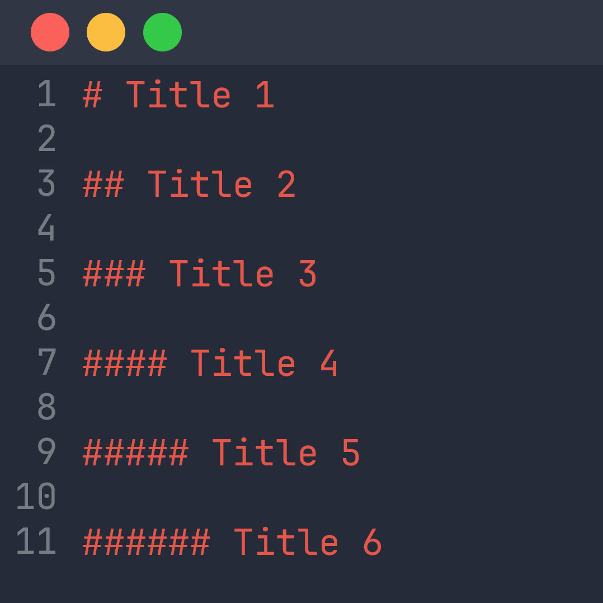
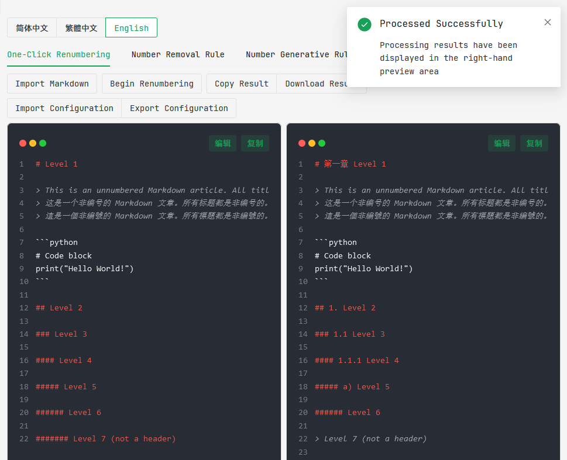
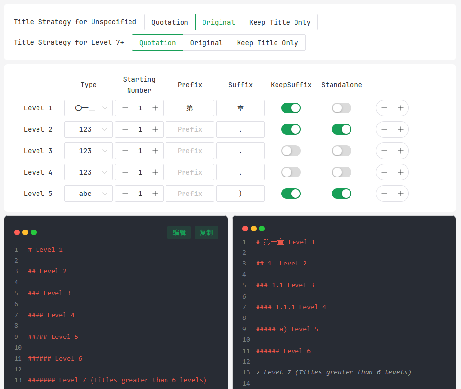
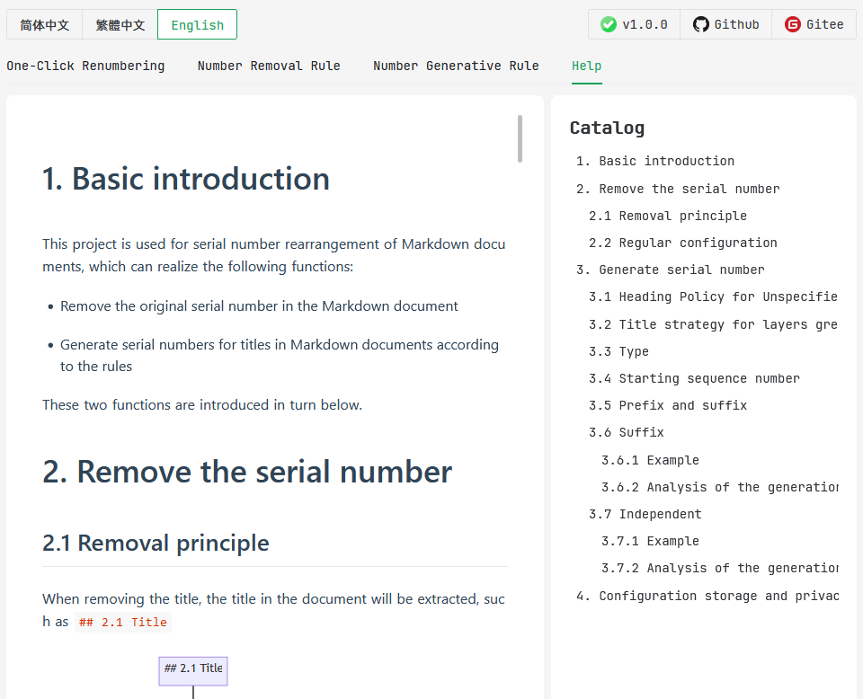

# 
Markdown title renumbering

[简体中文](/README.md) |
[繁體中文](/README-zh_TW.md) |
[English](/README-en_US.md)

    

## 1. Project background

When writing Markdown on a daily basis, we may encounter such a situation:

- Document migration and integration: when migrating or integrating documents, the original title number may be confused
- Document reconstruction: When reconstructing a document, for example, only one title is modified, but the numbers of all subsequent titles are changed.

These situations are time-consuming, labor-intensive, and error-prone to handle. Therefore, we urgently need a tool to help us solve these problems.

While searching the internet for solutions, I only found basic script code that was not very feature-rich and user-friendly. So I decided to develop a full-featured tool myself to solve these problems.

## 2. Project Features

- One-click processing: You only need to import the Markdown document to be numbered, and all operations can be completed
- The whole process of number removal and generation: the original title number can be removed and then re-numbered
- Operation-friendly: Web-based GUI interface, no need to execute code
- Highly customizable: Native serial number removal rules are implemented by regular expression lists, and number generation rules can be highly customized by users.
- Safe and reliable: the project is open source and documents can be processed offline. Configuration files are stored locally and are not uploaded to the server. No user information will be collected

## 3. Use

### 3.1 Third-party hosting page

You can use this project by visiting the following link:

- GitHub Page: [https://jiang-taibai.github.io/markdown-renumber/](https://jiang-taibai.github.io/markdown-renumber/)
- Gitee Page: [https://jiang-taibai.gitee.io/markdown-renumber/](https://jiang-taibai.gitee.io/markdown-renumber/)

### 3.2 Download to local

You can also download this project locally from [Releases](https://github.com/jiang-taibai/markdown-renumber/releases/latest) and open the `index.html` file in the compressed package to use it.

## 4. Project screenshots

In the main interface, after selecting to import a Markdown file, the original document will be displayed on the left and the processed document will be displayed on the right.

In the configuration interface, simply select, visually preview, and easily complete customization operations!

Rich help documentation makes it easy for you to get started!

## 4. Friendly links

This project uses the following open source projects:

- Running environment: [Node.js](https://github.com/nodejs/node)
- JavaScript framework: [Vue.js](https://github.com/vuejs/vue)
- UI library: [Naive UI](https://github.com/tusen-ai/naive-ui)
- Code highlighting support: [highlight.js](https://github.com/highlightjs/highlight.js)
- Help document Markdown rendering support: [md-editor-v3](https://github.com/imzbf/md-editor-v3)
- International support: [vue-i18n](https://github.com/kazupon/vue-i18n)

Font:

- English font: [JetBrains Mono](https://www.jetbrains.com/lp/mono/)
- Chinese font: [Alibaba inclusive body 3.0](https://fonts.alibabagroup.com/#/home)

## 5. Open source agreement

This project follows the [MIT](https://opensource.org/licenses/MIT) open source license.

CopyRight © 2023 [Jiang Liu](https://coderjiang.com)
