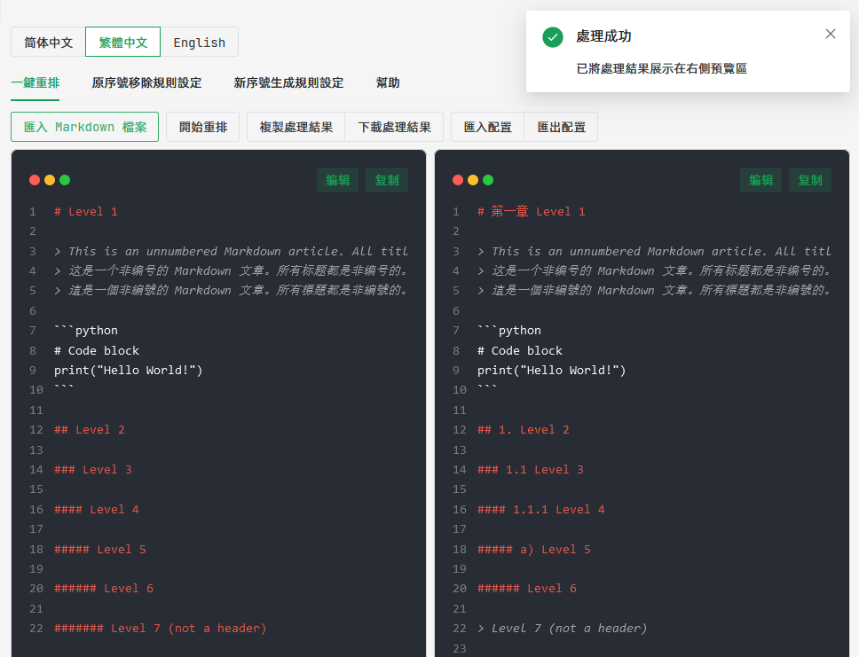
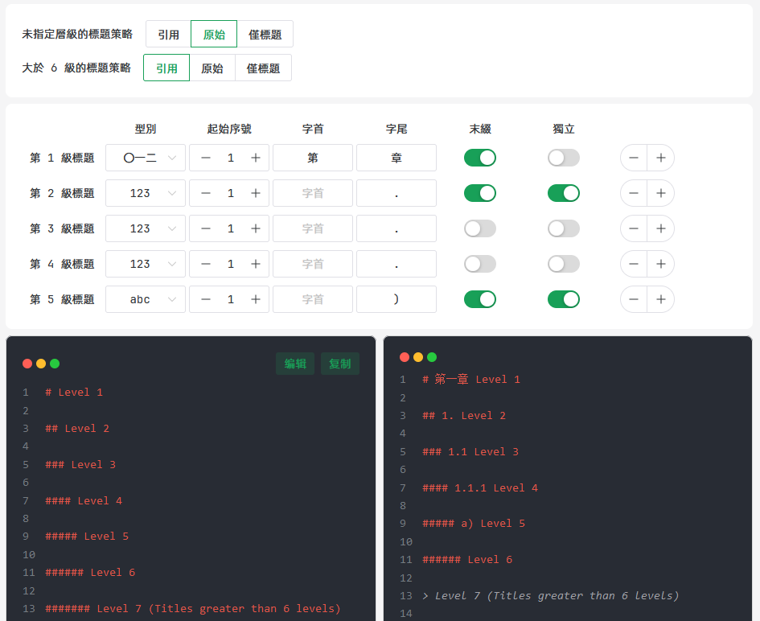
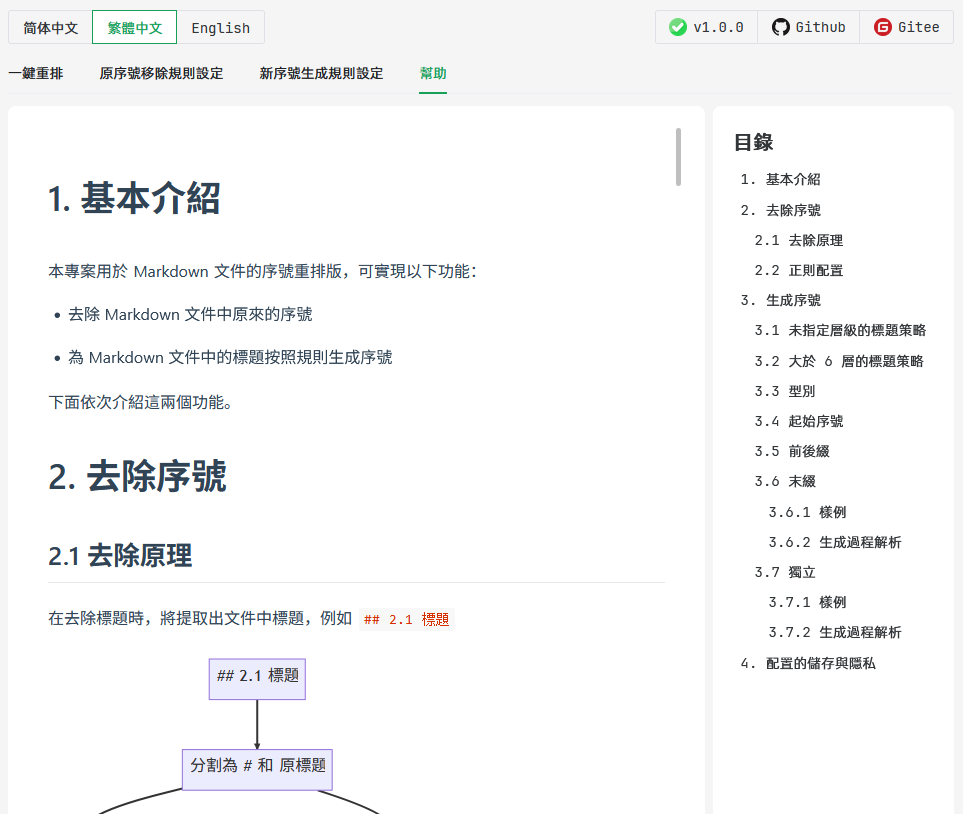

# 
Markdown 標題重編號

  
  
  

[简体中文](/README.md) |
[繁體中文](/README-zh_TW.md) |
[English](/README-en_US.md)

## 1. 專案背景

在日常寫 Markdown 時，我們可能會遇到這樣的情況：

- 文件的遷移與整合：在遷移或整合文件時，可能會讓原本的標題編號混亂
- 文件的重構：在重構文件時，例如僅僅修改了一處標題，但是卻導致了後續所有標題的編號都發生了變化

這些情況處理起來費時費力，而且容易出錯。因此，我們急需一個工具來幫助我們解決這些問題。

在搜尋網際網路的解決方案時，我只找到了基本的指令碼程式碼，功能不夠全面且不夠友好。於是我決定自己開發一個功能齊全的工具來解決這些問題。

## 2. 專案特點

- 一鍵式處理：你只需要匯入待編號的 Markdown 文件，即可完成所有的操作
- 編號的去除與生成全流程：能夠去除原來的標題編號，再重新編號
- 操作友好：基於 Web 的 GUI 介面，無需執行程式碼
- 高度自定義：原生序號去除規則由正則表示式列表實現，編號生成規則可由使用者高度自定義樣式
- 安全可靠：專案開源，離線處理文件。配置檔案儲存在本地，不會上傳到伺服器。不會收集使用者的任何資訊

## 3. 使用

### 3.1 第三方託管頁面

你可以訪問以下連結來使用本專案：

- GitHub Page: [https://jiang-taibai.github.io/markdown-renumber/](https://jiang-taibai.github.io/markdown-renumber/)
- Gitee Page: [https://jiang-taibai.gitee.io/markdown-renumber/](https://jiang-taibai.gitee.io/markdown-renumber/)

### 3.2 下載到本地

你也可以從 [Releases](https://github.com/jiang-taibai/markdown-renumber/releases/latest) 將本專案下載到本地，開啟壓縮包內的 `index.html` 檔案即可使用。

## 4. 專案截圖

在主介面中，選擇匯入 Markdown 檔案後，左側將展示原始文件，右側展示處理後的文件。

在配置介面中，簡單地選擇，視覺化地預覽，輕鬆完成定製化操作！

豐富的幫助文件，讓你輕鬆上手！

## 4. 友情連結

本專案使用到了以下開源專案：

- 執行環境：[Node.js](https://github.com/nodejs/node)
- JavaScript 框架：[Vue.js](https://github.com/vuejs/vue)
- UI 庫：[Naive UI](https://github.com/tusen-ai/naive-ui)
- 程式碼高亮支援：[highlight.js](https://github.com/highlightjs/highlight.js)
- 幫助文件 Markdown 渲染支援：[md-editor-v3](https://github.com/imzbf/md-editor-v3)
- 國際化支援：[vue-i18n](https://github.com/kazupon/vue-i18n)

字型：

- 英文字型：[JetBrains Mono](https://www.jetbrains.com/lp/mono/)
- 中文字型：[阿里巴巴普惠體 3.0](https://fonts.alibabagroup.com/#/home)

## 5. 開源協議

本專案遵循 [MIT](https://opensource.org/licenses/MIT) 開源協議。

CopyRight © 2023 [Jiang Liu](https://coderjiang.com)