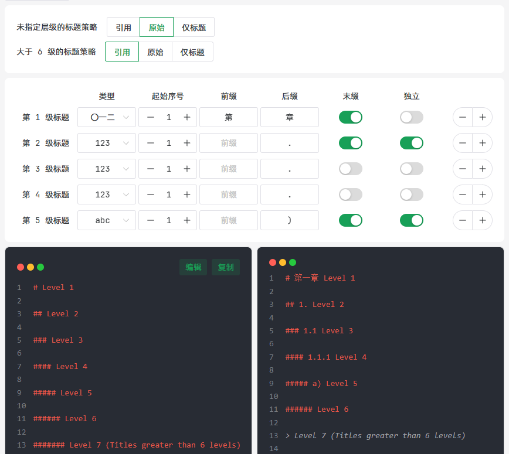
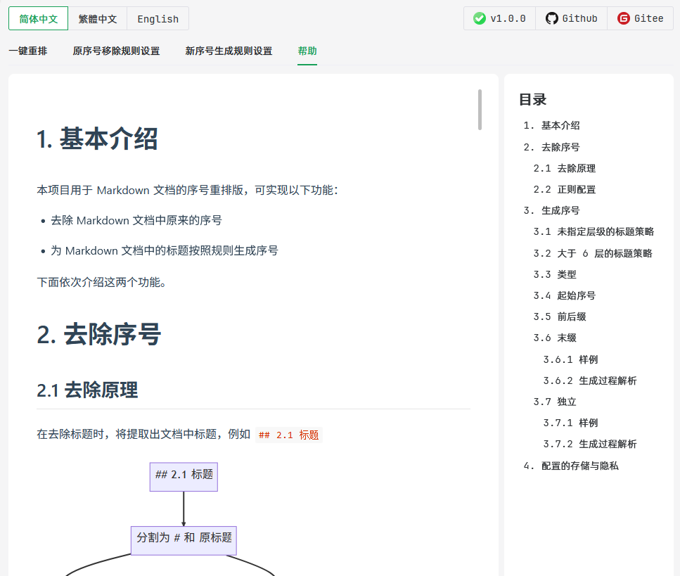

# 
Markdown 标题重编号

  
  
  
  

## 1. 项目背景

在日常写 Markdown 时，我们可能会遇到这样的情况：

- 文档的迁移与整合：在迁移或整合文档时，可能会让原本的标题编号混乱
- 文档的重构：在重构文档时，例如仅仅修改了一处标题，但是却导致了后续所有标题的编号都发生了变化

这些情况处理起来费时费力，而且容易出错。因此，我们急需一个工具来帮助我们解决这些问题。

在搜寻互联网的解决方案时，我只找到了基本的脚本代码，功能不够全面且不够友好。于是我决定自己开发一个功能齐全的工具来解决这些问题。

## 2. 项目特点

- 一键式处理：你只需要导入待编号的 Markdown 文档，即可完成所有的操作
- 编号的去除与生成：能够去除原来的标题编号，再重新编号
- 操作友好：基于 Web 的 GUI 界面，无需执行代码
- 高度自定义：原生序号去除规则由正则表达式列表实现，编号生成规则可由用户高度自定义样式
- 安全可靠：项目开源，离线处理文档。配置文件存储在本地，不会上传到服务器。不会收集用户的任何信息

## 3. 使用

### 3.1 第三方托管页面

你可以访问以下链接来使用本项目：

- GitHub Page: [#](#)
- Gitee Page: [#](#)

### 3.2 下载到本地

你也可以从 [release]() 将本项目下载到本地，打开压缩包内的 `index.html` 文件即可使用。

## 4. 项目截图

在主界面中，选择导入 Markdown 文件后，左侧将展示原始文档，右侧展示处理后的文档。

在配置界面中，简单地选择，可视化地预览，轻松完成定制化操作！

丰富的帮助文档，让你轻松上手！

## 4. 友情链接

本项目使用到了以下开源项目：

- 运行环境：[Node.js](https://github.com/nodejs/node)
- JavaScript 框架：[Vue.js](https://github.com/vuejs/vue)
- UI 库：[Naive UI](https://github.com/tusen-ai/naive-ui)
- 代码高亮支持：[highlight.js](https://github.com/highlightjs/highlight.js)
- 帮助文档 Markdown 渲染支持：[md-editor-v3](https://github.com/imzbf/md-editor-v3)

字体：

- 英文字体：[JetBrains Mono](https://www.jetbrains.com/lp/mono/)
- 中文字体：[阿里巴巴普惠体 3.0](https://fonts.alibabagroup.com/#/home)

## 5. 开源协议

本项目遵循 [MIT](https://opensource.org/licenses/MIT) 开源协议。

CopyRight © 2023 [Jiang Liu](https://coderjiang.com) All Rights Reserved.