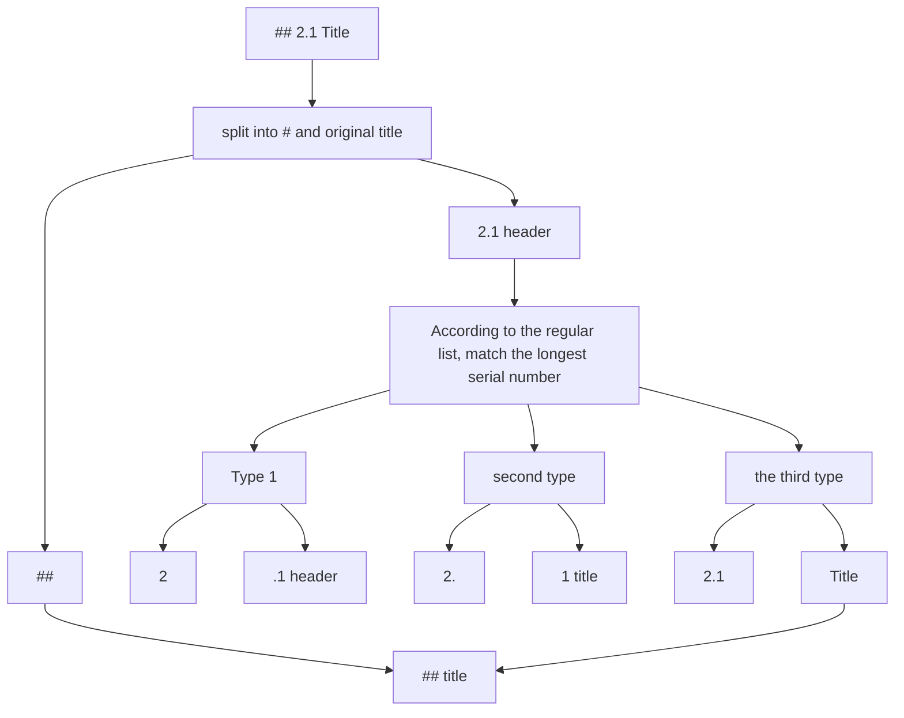
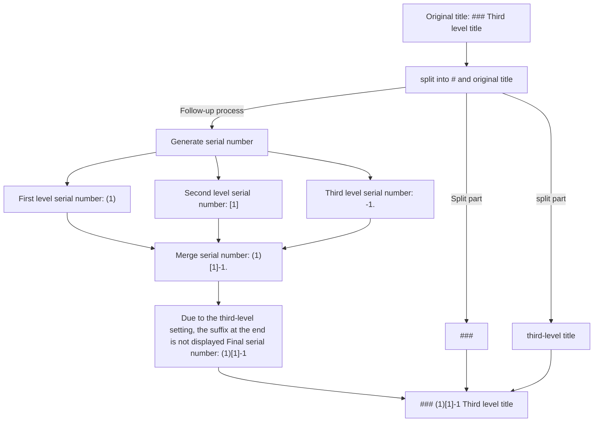
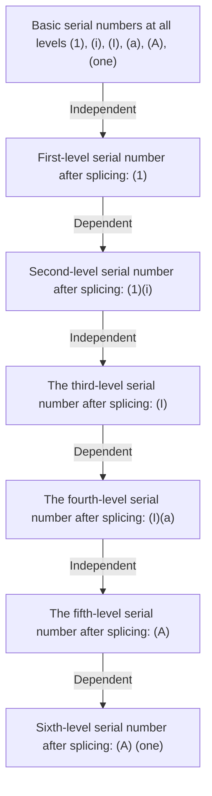

# 1. Basic introduction

This project is used for serial number rearrangement of Markdown documents, which can realize the following functions:

- Remove the original serial number in the Markdown document
- Generate serial numbers for titles in Markdown documents according to the rules

These two functions are introduced in turn below.

# 2. Remove the serial number

## 2.1 Removal principle

When removing the title, the title in the document will be extracted, such as `## 2.1 Title`



## 2.2 Regular configuration

You can configure a list of regular expressions in "Set the original serial number removal rule" to match the serial number in the title.
This regular expression list will be used in "According to the regular list, match to the longest serial number"

There may be multiple regular expressions that will match the serial number in the title. Here, the matched serial number is prioritized according to the length of the regular expression, and the longest serial number is used as the serial number of the title.

# 3. Generate serial number

## 3.1 Heading Policy for Unspecified Hierarchy

If you do not specify a title sequence number generation rule for a certain level, the "title policy for unspecified level" will be executed

There are three strategies:

- Quote: `#### Title` => `> Title`
- Original: `#### Title` => `#### Title`
- title only: `#### title` => `title`

Suppose your markdown is like this:

```markdown
# Title 1

## Title 2

### Title 3

#### Title 4
```

If you do not specify the rules for generating serial numbers for fourth-level titles, then the "unspecified-level title policy" will be executed. If "Reference" is selected:

(Ignore the generation of serial numbers here and only show the effect of this strategy)
```markdown
# Title One

## Title 2

### Title 3

> Title Four
```

## 3.2 Title strategy for layers greater than 6

In Markdown, titles greater than 6 levels are not supported, so when generating serial numbers if the title level is greater than 6, the "title strategy greater than 6 levels" will be used.

There are three strategies, and the effects of these three strategies are the same as those shown in the previous section.

- Quote: `##### title` => `> title`
- Original: `##### title` => `##### title`
- Title only: `##### title` => `title`

## 3.3 Type

The type is the type of the serial number generated, and the optional types are:

- Arabic numerals: `[0, 1, 2, 3, ...]`
- Lowercase letters: `[NULL, a, b, c, d, ...]`
- Capital letters: `[NULL, A, B, C, D, ...]`
- Roman numerals (lower case): `[NULL, i, ii, iii, iv, ...]`
- Roman numerals (upper case): `[NULL, I, II, III, IV, ...]`
- Chinese numbers (lowercase): `[〇, 一, 二, 三, 四, ...]`
- Chinese numerals (uppercase): `[zero, one, two, three, four, ...]`

**Note**: `NULL` here means the serial number that cannot be used, but for the alignment of each type, the numbering starts from 0.

By selecting the type, you can easily set the basic style of the serial number of each title

## 3.4 Starting sequence number

The starting sequence number is the starting value of the sequence number

> Sample 1: Arabic numerals, starting sequence number is 0

```markdown
# 0. Chapter 1

# 1. Chapter 2

# 2. Chapter Three
```

> Example 2: Lowercase Roman numerals, starting number is 1

**Note**: If the starting sequence number is n, it does not refer to the nth sequence number, but the sequence number with subscript n. (Equivalent to the concept of array subscript)

Refer to all values of Roman numerals: `[NULL, i, ii, iii, iv, ...]`

Because there is no 0 in Roman numerals , when the starting sequence number is 1, the sequence number will start from i.

```markdown
# i. Section 1

# ii. Section 2

# iii. Section 3
```

## 3.5 Prefix and suffix

The prefix and suffix are the characters before and after the serial number, which can be any string

> Example 1: Chinese numbers, the starting serial number is 1, the prefix is "第", and the suffix is "章"

```markdown
# Title of Chapter 1 Chapter 1

# Chapter 2 Title of Chapter 2

# Chapter 3 Title of Chapter 3
```

> Example 2: lowercase letters, the starting sequence number is 1, no prefix, and the suffix is ")"

```markdown
# a) Title of section one

# b) Title of section two

# c) Title of section three
```

## 3.6 Suffix

This option has two values, indicating whether to display the suffix at the end, which may not be easy to understand.

Here are a few examples:

### 3.6.1 Example

> Example 1:
> - First-level title: Arabic numerals, the starting sequence number is 1, the suffix is ".", and the suffix at the end is displayed
> - Second-level title: Arabic numerals, the starting sequence number is 1, the suffix is ".", **do not display** the suffix at the end
> - The third-level title: Arabic numerals, the starting sequence number is 1, the suffix is ".", and the suffix at the end is displayed

If the second-level title does not display the suffix at the end, it will not make the third-level title "1.11."

```markdown
# 1. Title

## 1.1 Title

### 1.1.1. Title
```

> Example 2:
> - First-level title: Arabic numerals, the starting sequence number is 1, and the suffix is ".", **Do not display the suffix at the end
> - Second-level title: Arabic numerals, the starting sequence number is 1, the suffix is ".", and the suffix at the end is displayed
> - The third-level title: Arabic numerals, the starting sequence number is 1, and the suffix is ".", **do not display the suffix at the end

If the first-level title does not display the trailing suffix, it will not make the second-level title "11."

```markdown
# 1 title

## 1.1. Title

### 1.1.1 Title
```

When implementing title generation, it is not simply to use the serial number of the upper-level title as the prefix of the lower-level title

### 3.6.2 Analysis of the generation process

The following shows the generation process of an unsightly but highly descriptive third-level title (the independent concept is not considered for the time being):

- First-level title: lowercase letters, starting number is 1, prefix is "(", suffix is ")", **do not display** the suffix at the end
- Second-level title: lowercase letters, starting number is 1, prefix is "\[", suffix is "\]", **does not display** the suffix at the end
- Third level title: Arabic numerals, starting number is 1, prefix is "-", suffix is ".", **does not display** the suffix at the end



This is the effect of this configuration:

```markdown
# (1 first level title

## (1)[1 Second level title

### (1)[1]-1 The third pole title
```

## 3.7 Independent

If a certain level of heading is independent, the serial numbers of the previous levels will not be spliced together.

### 3.7.1 Example

> Example 1:
> - First-level title: Arabic numerals, starting sequence number is 1, suffix is ".", showing the suffix at the end, independent
> - Second-level title: lowercase letters, starting sequence number is 1, suffix is ")", showing the suffix at the end, independent

```markdown
# 1. Title

## a) title
```

> Example 1:
> - The first-level title: Arabic numerals, the starting sequence number is 1, the suffix is ".", and the suffix at the end is displayed, independent
> - Second-level title: lowercase letters, the starting sequence number is 1, the suffix is ")", the suffix at the end is displayed, not independent

If the second-level headings are not independent, the serial numbers of the first-level headings will be spliced together

```markdown
# 1. Title

## 1.a) Title
```

### 3.7.2 Analysis of the generation process

The following shows the generation process for a hierarchical configuration with multiple independent or non-independent interweaving:

- Basic configuration of all titles: the starting sequence number is 1, the prefix is "(", the suffix is ")", and the suffix at the end is displayed
- First level headings: Arabic numerals, independent
- Second-level headings: lowercase Roman numerals, not independent
- 3rd level heading: uppercase Roman numerals, separate
- Level 4 headings: lowercase letters, not independent
- Level 5 headings: capital letters, standalone
- Level 6 title: lowercase Chinese, not independent



This is the effect of this configuration:

```markdown
# (1) Title 1

## (1)(i) Title 2

### (I) Title 3

#### (I)(a) Title 4

##### (A) Title 5

###### (A)(1) Title 6
```


# 4. Configuration storage and privacy

Configuration consists of two parts:
- Basic configuration: Remove the regular list of titles, the generation rules of new serial numbers
- Test sample: test the title list with the serial number removed, test the Markdown document with the serial number generated

In this project, the configured storage uses `localStorage`, which is the browser's local storage.

We promise not to upload your configuration to any server, nor to share your configuration with anyone. At the same time, any Markdown you upload and paste will not be saved locally, nor will it be uploaded to any server.

This means that if you switch browsers, your configuration will not be retained and you will need to reconfigure.

For the persistence of the configuration, you can still export the configuration. The exported configuration is a JSON string, which only includes the configuration and test samples, and does not include the Markdown document you uploaded.

**But for the sake of privacy and security, here are a few suggestions:**

1. Configuration settings: Do not write any sensitive information in configuration and test samples
2. Browser security: Do not use untrusted plug-ins and extensions in your browser

# 5. Project address

TODO


