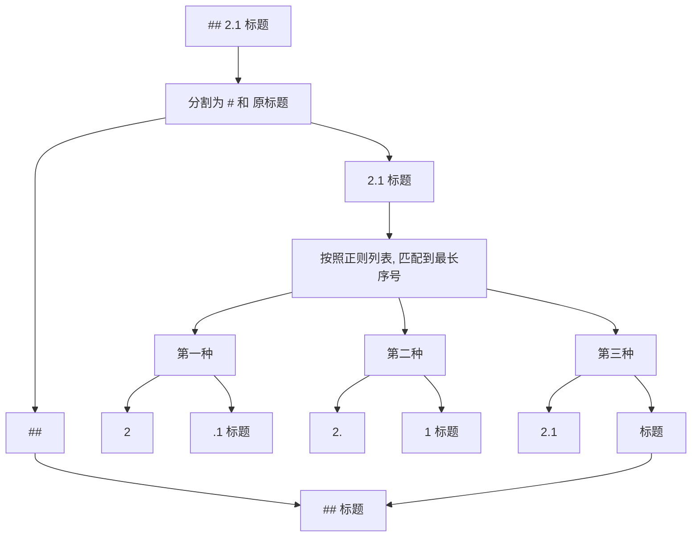
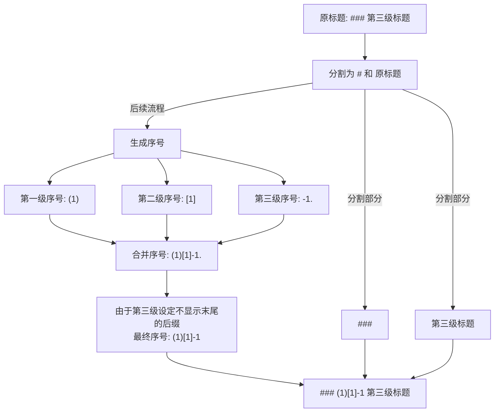
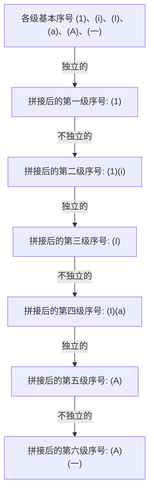

# 1. 基本介绍

本项目用于 Markdown 文档的序号重排版，可实现以下功能：

- 去除 Markdown 文档中原来的序号
- 为 Markdown 文档中的标题按照规则生成序号

下面依次介绍这两个功能。

# 2. 去除序号

## 2.1 去除原理

在去除标题时，将提取出文档中标题，例如 `## 2.1 标题`



## 2.2 正则配置

你可以在 “设置原序号移除规则” 中配置正则表达式列表，用于匹配标题中的序号。  
该正则表达式列表将在 “按照正则列表, 匹配到最长序号” 中使用

可能有多个正则会匹配到标题中的序号，这里将匹配到的序号按照正则表达式的长度作为优先级，取最长的序号作为标题的序号。

# 3. 生成序号

## 3.1 未指定层级的标题策略

如果你没有指定某一层级的标题序号生成规则，那么将执行“未指定层级的标题策略”

共有三种策略：

- 引用：`#### 标题` => `> 标题`
- 原始：`#### 标题` => `#### 标题`
- 仅标题：`#### 标题` => `标题`

假设你的 Markdown 是这样的：

```markdown
# 标题一

## 标题二

### 标题三

#### 标题四
```

如果你没有指定第四层标题生成序号的规则，那么将执行“未指定层级的标题策略”，如果选择“引用”：

（这里忽略序号的生成，仅展示该策略的效果）
```markdown
# 标题一

## 标题二

### 标题三

> 标题四
```

## 3.2 大于 6 层的标题策略

在 Markdown 中，并不支持大于 6 层的标题，故在生成序号时如果标题层级大于 6，将使用“大于 6 层的标题策略”

共有三种策略，这三种策略的效果与上一节中展示的是一样的。

- 引用：`##### 标题` => `> 标题`
- 原始：`##### 标题` => `##### 标题`
- 仅标题：`##### 标题` => `标题`

## 3.3 类型

类型即为生成序号的类型，可选的类型有：

- 阿拉伯数字：`[0, 1, 2, 3, ...]`
- 小写字母：`[NULL, a, b, c, d, ...]`
- 大写字母：`[NULL, A, B, C, D, ...]`
- 罗马数字（小写）：`[NULL, i, ii, iii, iv, ...]`
- 罗马数字（大写）：`[NULL, I, II, III, IV, ...]`
- 中文数字（小写）：`[〇, 一, 二, 三, 四, ...]`
- 中文数字（大写）：`[零, 壹, 贰, 叁, 肆, ...]`

**注意**：这里的 `NULL` 表示不能使用的序号，但为了各类型的对齐，一律从 0 开始编号。

通过选择类型，你可以轻松地设置每一个标题的序号的基本样式

## 3.4 起始序号

起始序号即序号的起始值

> 样例一：阿拉伯数字，起始序号为 0

```markdown
# 0. 章节一

# 1. 章节二

# 2. 章节三
```

> 样例二：小写罗马数字，起始序号为 1

**注意**：如果起始序号为 n，并不是指第 n 个序号，而是下标为 n 的序号。（等同于数组下标概念）

参考罗马数字的所有取值：`[NULL, i, ii, iii, iv, ...]`

因为罗马数字中没有 0，所以起始序号为 1 时，序号将从 i 开始。

```markdown
# i. 小节一

# ii. 小节二

# iii. 小节三
```

## 3.5 前后缀

前后缀即序号前后的字符，可以是任意字符串

> 样例一：中文数字，起始序号为 1，前缀为 “第”，后缀为 “章”

```markdown
# 第一章 章节一的标题

# 第二章 章节二的标题

# 第三章 章节三的标题
```

> 样例二：小写字母，起始序号为 1，无前缀，后缀为 “)”

```markdown
# a) 小节一的标题

# b) 小节二的标题

# c) 小节三的标题
```

## 3.6 末缀

该选项有两个值，表示是否显示末尾的后缀，这可能不太好理解。

下面先给出几个样例：

### 3.6.1 样例

> 样例一：
> - 第一级标题：阿拉伯数字，起始序号为 1，后缀为 “.”，显示末尾的后缀
> - 第二级标题：阿拉伯数字，起始序号为 1，后缀为 “.”，**不显示**末尾的后缀
> - 第三级标题：阿拉伯数字，起始序号为 1，后缀为 “.”，显示末尾的后缀

如果第二级标题不显示末尾的后缀，不会使得第三级标题为 “1.11.”

```markdown
# 1. 标题

## 1.1 标题

### 1.1.1. 标题
```

> 样例二：
> - 第一级标题：阿拉伯数字，起始序号为 1，后缀为 “.”，**不显示**末尾的后缀
> - 第二级标题：阿拉伯数字，起始序号为 1，后缀为 “.”，显示末尾的后缀
> - 第三级标题：阿拉伯数字，起始序号为 1，后缀为 “.”，**不显示**末尾的后缀

如果第一级标题不显示末尾的后缀，不会使得第二级标题为 “11.”

```markdown
# 1 标题

## 1.1. 标题

### 1.1.1 标题
```

在实现生成标题时，并不是简单地将上一级标题的序号作为下一级标题的前缀

### 3.6.2 生成过程解析

下面展示一个不太美观但表述性很强的三级标题的生成过程（暂时不考虑独立的概念）：

- 第一级标题：小写字母，起始序号为 1，前缀为 “(”，后缀为 “)”，**不显示**末尾的后缀
- 第二级标题：小写字母，起始序号为 1，前缀为 “\[”，后缀为 “\]”，**不显示**末尾的后缀
- 第三级标题：阿拉伯数字，起始序号为 1，前缀为 “-”，后缀为 “.”，**不显示**末尾的后缀



这是该配置下的效果：

```markdown
# (1 第一级标题

## (1)[1 第二级标题

### (1)[1]-1 第三极标题
```

## 3.7 独立

若某一级标题是独立的，那么就不会将之前层级的序号拼接在一起

### 3.7.1 样例

> 样例一：
> - 第一级标题：阿拉伯数字，起始序号为 1，后缀为 “.”，显示末尾的后缀，独立的
> - 第二级标题：小写字母，起始序号为 1，后缀为 “)”，显示末尾的后缀，独立的

```markdown
# 1. 标题

## a) 标题
```

> 样例一：
> - 第一级标题：阿拉伯数字，起始序号为 1，后缀为 “.”，显示末尾的后缀，独立的
> - 第二级标题：小写字母，起始序号为 1，后缀为 “)”，显示末尾的后缀，不独立的

如果第二级标题不独立，那么就会将第一级标题的序号拼接在一起

```markdown
# 1. 标题

## 1.a) 标题
```

### 3.7.2 生成过程解析

下面展示一个有多个独立或不独立交织的层级配置的生成过程：

- 所有标题基本配置：起始序号为 1，前缀为 “(”，后缀为 “)”，显示末尾的后缀
- 第一级标题：阿拉伯数字，独立的
- 第二级标题：小写罗马数字，不独立的
- 第三级标题：大写罗马数字，独立的
- 第四级标题：小写字母，不独立的
- 第五级标题：大写字母，独立的
- 第六级标题：小写中文，不独立的



这是该配置下的效果：

```markdown
# (1) 标题 1

## (1)(i) 标题 2

### (I) 标题 3

#### (I)(a) 标题 4

##### (A) 标题 5

###### (A)(一) 标题 6
```


# 4. 配置的存储与隐私

配置包含两部分：
- 基本配置：移除标题的正则列表、新序号的生成规则
- 测试样例：测试移除序号的标题列表、测试生成序号的 Markdown 文档

在本项目中，配置的存储使用了 `localStorage`，即浏览器本地存储。

我们承诺不会将你的配置上传到任何服务器，也不会将你的配置分享给任何人。同时你所上传和粘贴的任何 Markdown 都不会保存在本地，也不会上传到任何服务器。

这意味着如果你切换浏览器，那么你的配置将不会被保留，你需要重新配置。

为了配置的持久化，你依然可以导出配置，导出的配置是一个 JSON 字符串，仅包含配置和测试样例，不包含你所上传的 Markdown 文档。

**但为了隐私安全，这里建议一下几点：**

1. 配置设置：不要在配置和测试样例中写入任何敏感信息 
2. 浏览器安全：浏览器不要使用不可信的插件和扩展


