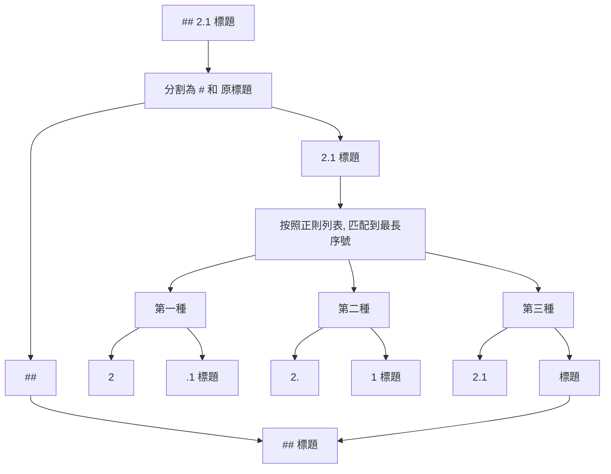
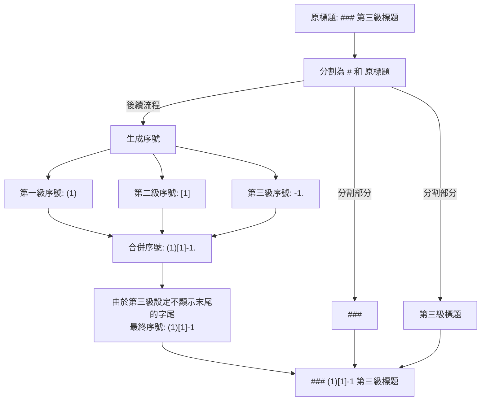
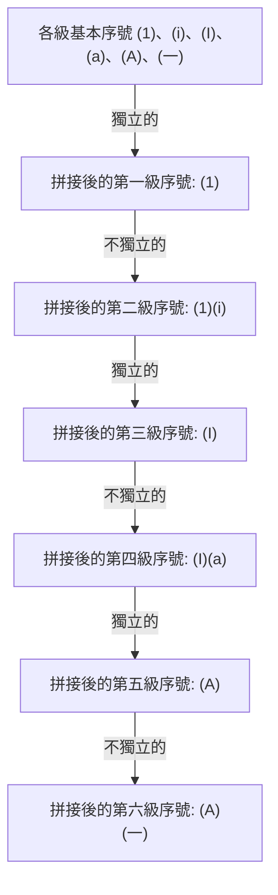

# 1. 基本介紹

本專案用於 Markdown 文件的序號重排版，可實現以下功能：

- 去除 Markdown 文件中原來的序號
- 為 Markdown 文件中的標題按照規則生成序號

下面依次介紹這兩個功能。

# 2. 去除序號

## 2.1 去除原理

在去除標題時，將提取出文件中標題，例如 `## 2.1 標題`



## 2.2 正則配置

你可以在 “設定原序號移除規則” 中配置正則表示式列表，用於匹配標題中的序號。  
該正則表示式列表將在 “按照正則列表, 匹配到最長序號” 中使用

可能有多個正則會匹配到標題中的序號，這裡將匹配到的序號按照正則表示式的長度作為優先順序，取最長的序號作為標題的序號。

# 3. 生成序號

## 3.1 未指定層級的標題策略

如果你沒有指定某一層級的標題序號生成規則，那麼將執行“未指定層級的標題策略”

共有三種策略：

- 引用：`#### 標題` => `> 標題`
- 原始：`#### 標題` => `#### 標題`
- 僅標題：`#### 標題` => `標題`

假設你的 Markdown 是這樣的：

```markdown
# 標題一

## 標題二

### 標題三

#### 標題四
```

如果你沒有指定第四層標題生成序號的規則，那麼將執行“未指定層級的標題策略”，如果選擇“引用”：

（這裡忽略序號的生成，僅展示該策略的效果）

```markdown
# 標題一

## 標題二

### 標題三

> 標題四
```

## 3.2 大於 6 層的標題策略

在 Markdown 中，並不支援大於 6 層的標題，故在生成序號時如果標題層級大於 6，將使用“大於 6 層的標題策略”

共有三種策略，這三種策略的效果與上一節中展示的是一樣的。

- 引用：`##### 標題` => `> 標題`
- 原始：`##### 標題` => `##### 標題`
- 僅標題：`##### 標題` => `標題`

## 3.3 型別

型別即為生成序號的型別，可選的型別有：

- 阿拉伯數字：`[0, 1, 2, 3, ...]`
- 小寫字母：`[NULL, a, b, c, d, ...]`
- 大寫字母：`[NULL, A, B, C, D, ...]`
- 羅馬數字（小寫）：`[NULL, i, ii, iii, iv, ...]`
- 羅馬數字（大寫）：`[NULL, I, II, III, IV, ...]`
- 中文數字（小寫）：`[〇, 一, 二, 三, 四, ...]`
- 中文數字（大寫）：`[零, 壹, 貳, 叄, 肆, ...]`

**注意**：這裡的 `NULL` 表示不能使用的序號，但為了各型別的對齊，一律從 0 開始編號。

透過選擇型別，你可以輕鬆地設定每一個標題的序號的基本樣式

## 3.4 起始序號

起始序號即序號的起始值

> 樣例一：阿拉伯數字，起始序號為 0

```markdown
# 0. 章節一

# 1. 章節二

# 2. 章節三
```

> 樣例二：小寫羅馬數字，起始序號為 1

**注意**：如果起始序號為 n，並不是指第 n 個序號，而是下標為 n 的序號。（等同於陣列下標概念）

參考羅馬數字的所有取值：`[NULL, i, ii, iii, iv, ...]`

因為羅馬數字中沒有 0，所以起始序號為 1 時，序號將從 i 開始。

```markdown
# i. 小節一

# ii. 小節二

# iii. 小節三
```

## 3.5 前後綴

前後綴即序號前後的字元，可以是任意字串

> 樣例一：中文數字，起始序號為 1，字首為 “第”，字尾為 “章”

```markdown
# 第一章 章節一的標題

# 第二章 章節二的標題

# 第三章 章節三的標題
```

> 樣例二：小寫字母，起始序號為 1，無字首，字尾為 “)”

```markdown
# a) 小節一的標題

# b) 小節二的標題

# c) 小節三的標題
```

## 3.6 末綴

該選項有兩個值，表示是否顯示末尾的字尾，這可能不太好理解。

下面先給出幾個樣例：

### 3.6.1 樣例

> 樣例一：
> - 第一級標題：阿拉伯數字，起始序號為 1，字尾為 “.”，顯示末尾的字尾
> - 第二級標題：阿拉伯數字，起始序號為 1，字尾為 “.”，**不顯示**末尾的字尾
> - 第三級標題：阿拉伯數字，起始序號為 1，字尾為 “.”，顯示末尾的字尾

如果第二級標題不顯示末尾的字尾，不會使得第三級標題為 “1.11.”

```markdown
# 1. 標題

## 1.1 標題

### 1.1.1. 標題
```

> 樣例二：
> - 第一級標題：阿拉伯數字，起始序號為 1，字尾為 “.”，**不顯示**末尾的字尾
> - 第二級標題：阿拉伯數字，起始序號為 1，字尾為 “.”，顯示末尾的字尾
> - 第三級標題：阿拉伯數字，起始序號為 1，字尾為 “.”，**不顯示**末尾的字尾

如果第一級標題不顯示末尾的字尾，不會使得第二級標題為 “11.”

```markdown
# 1 標題

## 1.1. 標題

### 1.1.1 標題
```

在實現生成標題時，並不是簡單地將上一級標題的序號作為下一級標題的字首

### 3.6.2 生成過程解析

下面展示一個不太美觀但表述性很強的三級標題的生成過程（暫時不考慮獨立的概念）：

- 第一級標題：小寫字母，起始序號為 1，字首為 “(”，字尾為 “)”，**不顯示**末尾的字尾
- 第二級標題：小寫字母，起始序號為 1，字首為 “\[”，字尾為 “\]”，**不顯示**末尾的字尾
- 第三級標題：阿拉伯數字，起始序號為 1，字首為 “-”，字尾為 “.”，**不顯示**末尾的字尾



這是該配置下的效果：

```markdown
# (1 第一級標題

## (1)[1 第二級標題

### (1)[1]-1 第三極標題
```

## 3.7 獨立

若某一級標題是獨立的，那麼就不會將之前層級的序號拼接在一起

### 3.7.1 樣例

> 樣例一：
> - 第一級標題：阿拉伯數字，起始序號為 1，字尾為 “.”，顯示末尾的字尾，獨立的
> - 第二級標題：小寫字母，起始序號為 1，字尾為 “)”，顯示末尾的字尾，獨立的

```markdown
# 1. 標題

## a) 標題
```

> 樣例一：
> - 第一級標題：阿拉伯數字，起始序號為 1，字尾為 “.”，顯示末尾的字尾，獨立的
> - 第二級標題：小寫字母，起始序號為 1，字尾為 “)”，顯示末尾的字尾，不獨立的

如果第二級標題不獨立，那麼就會將第一級標題的序號拼接在一起

```markdown
# 1. 標題

## 1.a) 標題
```

### 3.7.2 生成過程解析

下面展示一個有多個獨立或不獨立交織的層級配置的生成過程：

- 所有標題基本配置：起始序號為 1，字首為 “(”，字尾為 “)”，顯示末尾的字尾
- 第一級標題：阿拉伯數字，獨立的
- 第二級標題：小寫羅馬數字，不獨立的
- 第三級標題：大寫羅馬數字，獨立的
- 第四級標題：小寫字母，不獨立的
- 第五級標題：大寫字母，獨立的
- 第六級標題：小寫中文，不獨立的



這是該配置下的效果：

```markdown
# (1) 標題 1

## (1)(i) 標題 2

### (I) 標題 3

#### (I)(a) 標題 4

##### (A) 標題 5

###### (A)(一) 標題 6
```

# 4. 配置的儲存與隱私

配置包含兩部分：

- 基本配置：移除標題的正則列表、新序號的生成規則
- 測試樣例：測試移除序號的標題列表、測試生成序號的 Markdown 文件

在本專案中，配置的儲存使用了 `localStorage`，即瀏覽器本地儲存。

我們承諾不會將你的配置上傳到任何伺服器，也不會將你的配置分享給任何人。同時你所上傳和貼上的任何 Markdown 都不會儲存在本地，也不會上傳到任何伺服器。

這意味著如果你切換瀏覽器，那麼你的配置將不會被保留，你需要重新配置。

為了配置的持久化，你依然可以匯出配置，匯出的配置是一個 JSON 字串，僅包含配置和測試樣例，不包含你所上傳的 Markdown 文件。

**但為了隱私安全，這裡建議一下幾點：**

1. 配置設定：不要在配置和測試樣例中寫入任何敏感資訊
2. 瀏覽器安全：瀏覽器不要使用不可信的外掛和擴充套件

